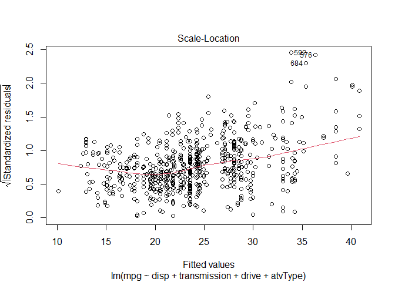
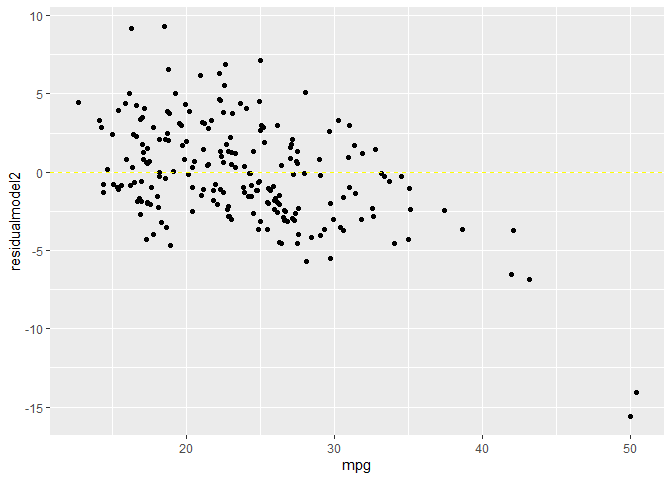

# R Programming: Linear Regression (OLS)

## Set Chunk requirements


```r
knitr::opts_chunk$set(echo = TRUE, message = FALSE, warning = FALSE)
#echo=FALSE indicates that the code will not be shown in the final document 
#(though any results/output would still be displayed).
#include=FALSE to have the chunk evaluated, but neither the code nor its output displayed
# warning=FALSE and message=FALSE suppress any R warnings or messages from being included 
#in the final document
```

## Load Relevant Packages and Data Set


```r
setwd('E:/Documents/Reinp/GitHub Respositories/Intro-to-ML-Regression-and-ML-Classification')

library(stats)
library(psych)
library(tidyverse)
## tidyverse includes readr, ggplot2, dplyr, forcats, tibble, tidyr, purrr, stringr

cars20_tr <- read_csv("data/cars20_train.csv")

view(cars20_tr)
```

## Exploratory Data Analysis

### Exploratory plots in base R 


```r
### Histogram of all MPGs

hist(cars20_tr$mpg, breaks = 30)
```

<!-- -->

```r
### Scatter plot of mpg vs disp 

plot(mpg~disp, data = cars20_tr)
```

<!-- -->

```r
### Box plots mpg vs transmission 
boxplot(mpg~transmission, data = cars20_tr)
```

<!-- -->

### Exploratory plots in ggplot2


```r
### What is the distribution of mpg?

mpg_hist <- ggplot(data = cars20_tr, 
       mapping = aes(
         x = mpg
       ) ) + geom_histogram(fill = "lightblue", colour = "black") +
  theme_bw()

mpg_hist
```

<!-- -->

```r
### What is the relationship between displacement and mpg?

displ_mpg_Scattplt <- ggplot(data = cars20_tr,
       mapping = aes(
         x = disp,
         y = mpg
       )) + geom_point(alpha = 0.3) + 
  geom_smooth()

displ_mpg_Scattplt
```

<!-- -->

```r
### What is the relationship between transmission type and mpg?

trans_mpg_boxplt <- ggplot(data = cars20_tr,
       aes(x = transmission, 
           y = mpg)) + 
  geom_boxplot() + theme_minimal()

trans_mpg_boxplt
```

<!-- -->

## Simple Linear Regression


```r
## Simple 1 variable model using displacement to predict mpg


model1 <- lm(mpg~disp, data = cars20_tr)

summary(model1)
```

```
## 
## Call:
## lm(formula = mpg ~ disp, data = cars20_tr)
## 
## Residuals:
##     Min      1Q  Median      3Q     Max 
## -7.9672 -2.6961 -0.9589  1.5168 26.2635 
## 
## Coefficients:
##             Estimate Std. Error t value Pr(>|t|)    
## (Intercept)  34.0545     0.4571   74.50   <2e-16 ***
## disp         -3.4271     0.1392  -24.62   <2e-16 ***
## ---
## Signif. codes:  0 '***' 0.001 '**' 0.01 '*' 0.05 '.' 0.1 ' ' 1
## 
## Residual standard error: 4.645 on 697 degrees of freedom
## Multiple R-squared:  0.4652,	Adjusted R-squared:  0.4644 
## F-statistic: 606.3 on 1 and 697 DF,  p-value: < 2.2e-16
```

```r
## To get the model predicted values, use the predict function. 
## It will output a vector of values: one for each car in the training data.

cars20_tr$predictmodel1 <- predict(model1, newdata = cars20_tr)

predict(model1, newdata = cars20_tr, interval = "confidence")
```

```
##           fit       lwr       upr
## 1   27.200426 26.754881 27.645971
## 2   27.885837 27.403839 28.367836
## 3   27.885837 27.403839 28.367836
## 4   27.885837 27.403839 28.367836
## 5   27.885837 27.403839 28.367836
## 6   27.200426 26.754881 27.645971
## 7   28.571249 28.049608 29.092889
## 8   25.829603 25.443849 26.215357
## 9   21.031724 20.627974 21.435474
## 10  25.829603 25.443849 26.215357
## 11  27.200426 26.754881 27.645971
## 12  27.200426 26.754881 27.645971
## 13  23.773369 23.428328 24.118410
## 14  27.200426 26.754881 27.645971
## 15  27.200426 26.754881 27.645971
## 16  27.200426 26.754881 27.645971
## 17  27.200426 26.754881 27.645971
## 18  27.200426 26.754881 27.645971
## 19  27.200426 26.754881 27.645971
## 20  27.200426 26.754881 27.645971
## 21  27.200426 26.754881 27.645971
## 22  23.773369 23.428328 24.118410
## 23  23.773369 23.428328 24.118410
## 24  23.773369 23.428328 24.118410
## 25  23.773369 23.428328 24.118410
## 26  23.773369 23.428328 24.118410
## 27  23.773369 23.428328 24.118410
## 28  23.773369 23.428328 24.118410
## 29  16.919256 16.280376 17.558135
## 30  27.200426 26.754881 27.645971
## 31  27.200426 26.754881 27.645971
## 32  27.200426 26.754881 27.645971
## 33  27.200426 26.754881 27.645971
## 34  27.200426 26.754881 27.645971
## 35  27.200426 26.754881 27.645971
## 36  27.200426 26.754881 27.645971
## 37  23.773369 23.428328 24.118410
## 38  23.773369 23.428328 24.118410
## 39  23.773369 23.428328 24.118410
## 40  23.773369 23.428328 24.118410
## 41  23.773369 23.428328 24.118410
## 42  23.773369 23.428328 24.118410
## 43  23.773369 23.428328 24.118410
## 44  23.773369 23.428328 24.118410
## 45  27.200426 26.754881 27.645971
## 46  27.200426 26.754881 27.645971
## 47  23.773369 23.428328 24.118410
## 48  23.773369 23.428328 24.118410
## 49  23.773369 23.428328 24.118410
## 50  25.829603 25.443849 26.215357
## 51  22.059841 21.691971 22.427710
## 52  27.200426 26.754881 27.645971
## 53  23.773369 23.428328 24.118410
## 54  23.773369 23.428328 24.118410
## 55  27.200426 26.754881 27.645971
## 56  27.200426 26.754881 27.645971
## 57  27.200426 26.754881 27.645971
## 58  23.773369 23.428328 24.118410
## 59  23.773369 23.428328 24.118410
## 60  23.773369 23.428328 24.118410
## 61  23.773369 23.428328 24.118410
## 62  23.773369 23.428328 24.118410
## 63  23.773369 23.428328 24.118410
## 64  23.773369 23.428328 24.118410
## 65  18.975490 18.466856 19.484124
## 66  11.435965 10.401767 12.470162
## 67  21.717135 21.338898 22.095372
## 68  16.919256 16.280376 17.558135
## 69  23.773369 23.428328 24.118410
## 70  21.374429 20.984183 21.764675
## 71  21.374429 20.984183 21.764675
## 72  27.200426 26.754881 27.645971
## 73  27.200426 26.754881 27.645971
## 74  27.200426 26.754881 27.645971
## 75  27.200426 26.754881 27.645971
## 76  22.059841 21.691971 22.427710
## 77  16.233844 15.548327 16.919361
## 78  16.233844 15.548327 16.919361
## 79  16.233844 15.548327 16.919361
## 80  16.233844 15.548327 16.919361
## 81  20.346312 19.911642 20.780983
## 82  22.745252 22.392636 23.097868
## 83  29.256660 28.692862 29.820459
## 84  22.745252 22.392636 23.097868
## 85  27.200426 26.754881 27.645971
## 86  27.200426 26.754881 27.645971
## 87  28.571249 28.049608 29.092889
## 88  28.571249 28.049608 29.092889
## 89  27.200426 26.754881 27.645971
## 90  27.200426 26.754881 27.645971
## 91  21.031724 20.627974 21.435474
## 92  21.717135 21.338898 22.095372
## 93  25.829603 25.443849 26.215357
## 94  25.486898 25.112580 25.861215
## 95  25.829603 25.443849 26.215357
## 96  25.486898 25.112580 25.861215
## 97  27.200426 26.754881 27.645971
## 98  27.200426 26.754881 27.645971
## 99  25.829603 25.443849 26.215357
## 100 23.773369 23.428328 24.118410
## 101 16.919256 16.280376 17.558135
## 102 29.256660 28.692862 29.820459
## 103 29.256660 28.692862 29.820459
## 104 16.919256 16.280376 17.558135
## 105 28.571249 28.049608 29.092889
## 106 28.571249 28.049608 29.092889
## 107 27.200426 26.754881 27.645971
## 108 27.200426 26.754881 27.645971
## 109 22.745252 22.392636 23.097868
## 110 16.919256 16.280376 17.558135
## 111 16.919256 16.280376 17.558135
## 112 25.829603 25.443849 26.215357
## 113 27.200426 26.754881 27.645971
## 114 27.200426 26.754881 27.645971
## 115 25.829603 25.443849 26.215357
## 116 27.200426 26.754881 27.645971
## 117 25.829603 25.443849 26.215357
## 118 27.200426 26.754881 27.645971
## 119 27.200426 26.754881 27.645971
## 120 26.172309 25.773571 26.571047
## 121 23.773369 23.428328 24.118410
## 122 26.172309 25.773571 26.571047
## 123 23.773369 23.428328 24.118410
## 124 27.200426 26.754881 27.645971
## 125 27.200426 26.754881 27.645971
## 126 27.200426 26.754881 27.645971
## 127 27.200426 26.754881 27.645971
## 128 27.200426 26.754881 27.645971
## 129 27.200426 26.754881 27.645971
## 130 27.200426 26.754881 27.645971
## 131 28.913954 28.371514 29.456395
## 132 27.200426 26.754881 27.645971
## 133 27.200426 26.754881 27.645971
## 134 27.200426 26.754881 27.645971
## 135 27.200426 26.754881 27.645971
## 136 27.200426 26.754881 27.645971
## 137 27.200426 26.754881 27.645971
## 138 23.773369 23.428328 24.118410
## 139 22.745252 22.392636 23.097868
## 140 29.256660 28.692862 29.820459
## 141 29.256660 28.692862 29.820459
## 142 27.200426 26.754881 27.645971
## 143 21.717135 21.338898 22.095372
## 144 27.200426 26.754881 27.645971
## 145 27.200426 26.754881 27.645971
## 146 27.885837 27.403839 28.367836
## 147 29.256660 28.692862 29.820459
## 148 25.486898 25.112580 25.861215
## 149 25.486898 25.112580 25.861215
## 150 25.486898 25.112580 25.861215
## 151 27.200426 26.754881 27.645971
## 152 22.745252 22.392636 23.097868
## 153 29.256660 28.692862 29.820459
## 154 27.200426 26.754881 27.645971
## 155 22.059841 21.691971 22.427710
## 156 27.200426 26.754881 27.645971
## 157 27.200426 26.754881 27.645971
## 158 27.200426 26.754881 27.645971
## 159 12.806787 11.874922 13.738652
## 160 27.200426 26.754881 27.645971
## 161 27.200426 26.754881 27.645971
## 162 28.571249 28.049608 29.092889
## 163 27.200426 26.754881 27.645971
## 164 25.486898 25.112580 25.861215
## 165 27.200426 26.754881 27.645971
## 166 27.200426 26.754881 27.645971
## 167 25.486898 25.112580 25.861215
## 168 25.829603 25.443849 26.215357
## 169 28.913954 28.371514 29.456395
## 170 28.913954 28.371514 29.456395
## 171 25.486898 25.112580 25.861215
## 172 25.486898 25.112580 25.861215
## 173 12.806787 11.874922 13.738652
## 174 15.891139 15.181874 16.600403
## 175 15.891139 15.181874 16.600403
## 176 15.891139 15.181874 16.600403
## 177 15.891139 15.181874 16.600403
## 178 12.806787 11.874922 13.738652
## 179 12.806787 11.874922 13.738652
## 180 15.891139 15.181874 16.600403
## 181 15.891139 15.181874 16.600403
## 182 12.806787 11.874922 13.738652
## 183 12.806787 11.874922 13.738652
## 184 20.346312 19.911642 20.780983
## 185 27.200426 26.754881 27.645971
## 186 27.200426 26.754881 27.645971
## 187 22.745252 22.392636 23.097868
## 188 22.745252 22.392636 23.097868
## 189 22.745252 22.392636 23.097868
## 190 12.806787 11.874922 13.738652
## 191 12.806787 11.874922 13.738652
## 192 20.346312 19.911642 20.780983
## 193 21.031724 20.627974 21.435474
## 194 22.745252 22.392636 23.097868
## 195 22.745252 22.392636 23.097868
## 196 24.458781 24.108071 24.809490
## 197 21.717135 21.338898 22.095372
## 198 25.486898 25.112580 25.861215
## 199 24.458781 24.108071 24.809490
## 200 25.486898 25.112580 25.861215
## 201 24.458781 24.108071 24.809490
## 202 24.458781 24.108071 24.809490
## 203 21.717135 21.338898 22.095372
## 204 25.486898 25.112580 25.861215
## 205 25.486898 25.112580 25.861215
## 206 30.627483 29.973793 31.281172
## 207 27.200426 26.754881 27.645971
## 208 15.891139 15.181874 16.600403
## 209 16.919256 16.280376 17.558135
## 210 16.919256 16.280376 17.558135
## 211 16.919256 16.280376 17.558135
## 212 16.919256 16.280376 17.558135
## 213 21.717135 21.338898 22.095372
## 214 21.717135 21.338898 22.095372
## 215 28.913954 28.371514 29.456395
## 216 28.913954 28.371514 29.456395
## 217 21.717135 21.338898 22.095372
## 218 14.520316 13.713789 15.326842
## 219 21.717135 21.338898 22.095372
## 220 14.520316 13.713789 15.326842
## 221 22.059841 21.691971 22.427710
## 222 27.200426 26.754881 27.645971
## 223 25.486898 25.112580 25.861215
## 224 22.059841 21.691971 22.427710
## 225 23.773369 23.428328 24.118410
## 226 23.773369 23.428328 24.118410
## 227 27.200426 26.754881 27.645971
## 228 23.087958 22.739988 23.435927
## 229 27.200426 26.754881 27.645971
## 230 23.087958 22.739988 23.435927
## 231 21.717135 21.338898 22.095372
## 232 21.717135 21.338898 22.095372
## 233 21.717135 21.338898 22.095372
## 234 27.200426 26.754881 27.645971
## 235 25.486898 25.112580 25.861215
## 236 23.773369 23.428328 24.118410
## 237 23.773369 23.428328 24.118410
## 238 20.689018 20.270414 21.107622
## 239 12.464082 11.506778 13.421385
## 240 28.913954 28.371514 29.456395
## 241 23.773369 23.428328 24.118410
## 242 23.773369 23.428328 24.118410
## 243 18.975490 18.466856 19.484124
## 244 23.773369 23.428328 24.118410
## 245 28.913954 28.371514 29.456395
## 246 27.200426 26.754881 27.645971
## 247 27.200426 26.754881 27.645971
## 248 27.200426 26.754881 27.645971
## 249 23.773369 23.428328 24.118410
## 250 28.913954 28.371514 29.456395
## 251 22.059841 21.691971 22.427710
## 252 27.200426 26.754881 27.645971
## 253 27.200426 26.754881 27.645971
## 254 23.773369 23.428328 24.118410
## 255 23.773369 23.428328 24.118410
## 256 23.773369 23.428328 24.118410
## 257 18.975490 18.466856 19.484124
## 258 23.773369 23.428328 24.118410
## 259 25.486898 25.112580 25.861215
## 260 25.486898 25.112580 25.861215
## 261 25.486898 25.112580 25.861215
## 262 23.773369 23.428328 24.118410
## 263 28.913954 28.371514 29.456395
## 264 27.200426 26.754881 27.645971
## 265 27.200426 26.754881 27.645971
## 266 27.200426 26.754881 27.645971
## 267 27.200426 26.754881 27.645971
## 268 18.975490 18.466856 19.484124
## 269 21.717135 21.338898 22.095372
## 270 21.717135 21.338898 22.095372
## 271 21.717135 21.338898 22.095372
## 272 28.913954 28.371514 29.456395
## 273 28.913954 28.371514 29.456395
## 274 23.773369 23.428328 24.118410
## 275 22.059841 21.691971 22.427710
## 276 27.200426 26.754881 27.645971
## 277 27.200426 26.754881 27.645971
## 278 27.200426 26.754881 27.645971
## 279 23.773369 23.428328 24.118410
## 280 27.200426 26.754881 27.645971
## 281 27.200426 26.754881 27.645971
## 282 27.200426 26.754881 27.645971
## 283 21.717135 21.338898 22.095372
## 284 28.913954 28.371514 29.456395
## 285 21.717135 21.338898 22.095372
## 286 14.520316 13.713789 15.326842
## 287 21.717135 21.338898 22.095372
## 288 18.975490 18.466856 19.484124
## 289 18.975490 18.466856 19.484124
## 290 21.717135 21.338898 22.095372
## 291 21.717135 21.338898 22.095372
## 292 14.520316 13.713789 15.326842
## 293 23.773369 23.428328 24.118410
## 294 21.031724 20.627974 21.435474
## 295 23.773369 23.428328 24.118410
## 296 23.773369 23.428328 24.118410
## 297 23.773369 23.428328 24.118410
## 298 28.571249 28.049608 29.092889
## 299 28.571249 28.049608 29.092889
## 300 27.200426 26.754881 27.645971
## 301 27.200426 26.754881 27.645971
## 302 27.200426 26.754881 27.645971
## 303 27.200426 26.754881 27.645971
## 304 23.773369 23.428328 24.118410
## 305 27.200426 26.754881 27.645971
## 306 23.773369 23.428328 24.118410
## 307 22.059841 21.691971 22.427710
## 308 22.059841 21.691971 22.427710
## 309 25.486898 25.112580 25.861215
## 310 23.773369 23.428328 24.118410
## 311 23.773369 23.428328 24.118410
## 312 23.773369 23.428328 24.118410
## 313 19.318195 18.829292 19.807098
## 314 15.891139 15.181874 16.600403
## 315 24.801486 24.444822 25.158150
## 316 15.891139 15.181874 16.600403
## 317 24.801486 24.444822 25.158150
## 318 24.801486 24.444822 25.158150
## 319 15.891139 15.181874 16.600403
## 320 14.520316 13.713789 15.326842
## 321 15.891139 15.181874 16.600403
## 322 15.891139 15.181874 16.600403
## 323 12.806787 11.874922 13.738652
## 324 15.891139 15.181874 16.600403
## 325 15.891139 15.181874 16.600403
## 326 15.891139 15.181874 16.600403
## 327 24.801486 24.444822 25.158150
## 328 19.318195 18.829292 19.807098
## 329 15.891139 15.181874 16.600403
## 330 15.891139 15.181874 16.600403
## 331 15.891139 15.181874 16.600403
## 332 24.801486 24.444822 25.158150
## 333 12.806787 11.874922 13.738652
## 334 12.806787 11.874922 13.738652
## 335 15.891139 15.181874 16.600403
## 336 23.773369 23.428328 24.118410
## 337 24.801486 24.444822 25.158150
## 338 19.318195 18.829292 19.807098
## 339 14.520316 13.713789 15.326842
## 340 19.318195 18.829292 19.807098
## 341 19.318195 18.829292 19.807098
## 342 19.318195 18.829292 19.807098
## 343 15.891139 15.181874 16.600403
## 344 15.891139 15.181874 16.600403
## 345 25.829603 25.443849 26.215357
## 346 25.829603 25.443849 26.215357
## 347 27.200426 26.754881 27.645971
## 348 21.717135 21.338898 22.095372
## 349 25.829603 25.443849 26.215357
## 350 25.829603 25.443849 26.215357
## 351 27.200426 26.754881 27.645971
## 352 21.717135 21.338898 22.095372
## 353 14.520316 13.713789 15.326842
## 354 21.717135 21.338898 22.095372
## 355 20.689018 20.270414 21.107622
## 356 28.913954 28.371514 29.456395
## 357 25.486898 25.112580 25.861215
## 358 25.486898 25.112580 25.861215
## 359 27.200426 26.754881 27.645971
## 360 27.200426 26.754881 27.645971
## 361 27.200426 26.754881 27.645971
## 362 15.891139 15.181874 16.600403
## 363 21.717135 21.338898 22.095372
## 364 22.059841 21.691971 22.427710
## 365 27.200426 26.754881 27.645971
## 366 27.200426 26.754881 27.645971
## 367 27.200426 26.754881 27.645971
## 368 27.200426 26.754881 27.645971
## 369 22.059841 21.691971 22.427710
## 370 22.059841 21.691971 22.427710
## 371 22.059841 21.691971 22.427710
## 372 27.200426 26.754881 27.645971
## 373 27.200426 26.754881 27.645971
## 374 22.059841 21.691971 22.427710
## 375 25.486898 25.112580 25.861215
## 376 22.059841 21.691971 22.427710
## 377 27.885837 27.403839 28.367836
## 378 23.773369 23.428328 24.118410
## 379 23.773369 23.428328 24.118410
## 380 23.773369 23.428328 24.118410
## 381 23.773369 23.428328 24.118410
## 382 24.116075 23.769263 24.462887
## 383 24.116075 23.769263 24.462887
## 384 24.116075 23.769263 24.462887
## 385 20.346312 19.911642 20.780983
## 386 20.346312 19.911642 20.780983
## 387 20.346312 19.911642 20.780983
## 388 20.346312 19.911642 20.780983
## 389 27.200426 26.754881 27.645971
## 390 27.200426 26.754881 27.645971
## 391 27.200426 26.754881 27.645971
## 392 27.200426 26.754881 27.645971
## 393 27.200426 26.754881 27.645971
## 394 25.829603 25.443849 26.215357
## 395 22.745252 22.392636 23.097868
## 396 20.346312 19.911642 20.780983
## 397 20.346312 19.911642 20.780983
## 398 14.520316 13.713789 15.326842
## 399 21.717135 21.338898 22.095372
## 400 27.200426 26.754881 27.645971
## 401 27.200426 26.754881 27.645971
## 402 27.200426 26.754881 27.645971
## 403 27.200426 26.754881 27.645971
## 404 27.200426 26.754881 27.645971
## 405 26.172309 25.773571 26.571047
## 406 16.919256 16.280376 17.558135
## 407 26.172309 25.773571 26.571047
## 408 16.919256 16.280376 17.558135
## 409 16.919256 16.280376 17.558135
## 410 26.172309 25.773571 26.571047
## 411 22.059841 21.691971 22.427710
## 412 21.717135 21.338898 22.095372
## 413 22.059841 21.691971 22.427710
## 414 12.121376 11.138533 13.104219
## 415 22.059841 21.691971 22.427710
## 416 22.059841 21.691971 22.427710
## 417 14.520316 13.713789 15.326842
## 418 23.773369 23.428328 24.118410
## 419 23.773369 23.428328 24.118410
## 420 27.200426 26.754881 27.645971
## 421 27.200426 26.754881 27.645971
## 422 27.200426 26.754881 27.645971
## 423 27.200426 26.754881 27.645971
## 424 20.346312 19.911642 20.780983
## 425 18.975490 18.466856 19.484124
## 426 18.975490 18.466856 19.484124
## 427 18.975490 18.466856 19.484124
## 428 16.233844 15.548327 16.919361
## 429 27.200426 26.754881 27.645971
## 430 28.913954 28.371514 29.456395
## 431 28.913954 28.371514 29.456395
## 432 27.200426 26.754881 27.645971
## 433 18.975490 18.466856 19.484124
## 434 27.200426 26.754881 27.645971
## 435 11.435965 10.401767 12.470162
## 436 27.200426 26.754881 27.645971
## 437 27.200426 26.754881 27.645971
## 438 27.200426 26.754881 27.645971
## 439 27.200426 26.754881 27.645971
## 440 22.059841 21.691971 22.427710
## 441 25.486898 25.112580 25.861215
## 442 25.486898 25.112580 25.861215
## 443 25.486898 25.112580 25.861215
## 444 22.059841 21.691971 22.427710
## 445 27.200426 26.754881 27.645971
## 446 11.093259 10.033261 12.153257
## 447 11.435965 10.401767 12.470162
## 448 27.200426 26.754881 27.645971
## 449 27.200426 26.754881 27.645971
## 450 27.200426 26.754881 27.645971
## 451 11.093259 10.033261 12.153257
## 452 24.801486 24.444822 25.158150
## 453 22.059841 21.691971 22.427710
## 454 22.059841 21.691971 22.427710
## 455 24.801486 24.444822 25.158150
## 456 29.599366 29.013713 30.185018
## 457 25.829603 25.443849 26.215357
## 458 27.200426 26.754881 27.645971
## 459 27.200426 26.754881 27.645971
## 460 29.599366 29.013713 30.185018
## 461 27.200426 26.754881 27.645971
## 462 23.773369 23.428328 24.118410
## 463 14.863021 14.081109 15.644934
## 464 23.773369 23.428328 24.118410
## 465 20.346312 19.911642 20.780983
## 466 27.200426 26.754881 27.645971
## 467 23.773369 23.428328 24.118410
## 468 23.773369 23.428328 24.118410
## 469 23.773369 23.428328 24.118410
## 470 28.913954 28.371514 29.456395
## 471 28.913954 28.371514 29.456395
## 472 28.913954 28.371514 29.456395
## 473 27.200426 26.754881 27.645971
## 474 27.200426 26.754881 27.645971
## 475 28.913954 28.371514 29.456395
## 476 27.200426 26.754881 27.645971
## 477 27.200426 26.754881 27.645971
## 478 27.200426 26.754881 27.645971
## 479 24.801486 24.444822 25.158150
## 480 27.200426 26.754881 27.645971
## 481 27.200426 26.754881 27.645971
## 482 24.801486 24.444822 25.158150
## 483 26.172309 25.773571 26.571047
## 484 22.059841 21.691971 22.427710
## 485 22.059841 21.691971 22.427710
## 486 23.773369 23.428328 24.118410
## 487 23.773369 23.428328 24.118410
## 488 20.346312 19.911642 20.780983
## 489 27.200426 26.754881 27.645971
## 490 27.200426 26.754881 27.645971
## 491 28.571249 28.049608 29.092889
## 492 28.571249 28.049608 29.092889
## 493 22.059841 21.691971 22.427710
## 494 22.059841 21.691971 22.427710
## 495 27.200426 26.754881 27.645971
## 496 27.200426 26.754881 27.645971
## 497 27.200426 26.754881 27.645971
## 498 27.200426 26.754881 27.645971
## 499 27.200426 26.754881 27.645971
## 500 20.346312 19.911642 20.780983
## 501 20.346312 19.911642 20.780983
## 502 27.200426 26.754881 27.645971
## 503 22.059841 21.691971 22.427710
## 504 16.919256 16.280376 17.558135
## 505 20.346312 19.911642 20.780983
## 506 27.200426 26.754881 27.645971
## 507 22.059841 21.691971 22.427710
## 508 22.059841 21.691971 22.427710
## 509 22.059841 21.691971 22.427710
## 510 22.402546 22.043261 22.761832
## 511 22.402546 22.043261 22.761832
## 512 27.200426 26.754881 27.645971
## 513 27.200426 26.754881 27.645971
## 514 28.913954 28.371514 29.456395
## 515 28.913954 28.371514 29.456395
## 516 27.200426 26.754881 27.645971
## 517 27.200426 26.754881 27.645971
## 518 23.773369 23.428328 24.118410
## 519 23.773369 23.428328 24.118410
## 520 27.200426 26.754881 27.645971
## 521 27.200426 26.754881 27.645971
## 522 27.200426 26.754881 27.645971
## 523 11.778670 10.770193 12.787147
## 524 11.778670 10.770193 12.787147
## 525 23.773369 23.428328 24.118410
## 526 23.773369 23.428328 24.118410
## 527 23.773369 23.428328 24.118410
## 528 23.773369 23.428328 24.118410
## 529 22.745252 22.392636 23.097868
## 530 16.919256 16.280376 17.558135
## 531 22.059841 21.691971 22.427710
## 532 22.059841 21.691971 22.427710
## 533 24.801486 24.444822 25.158150
## 534 22.745252 22.392636 23.097868
## 535 22.059841 21.691971 22.427710
## 536 27.200426 26.754881 27.645971
## 537 27.200426 26.754881 27.645971
## 538 27.200426 26.754881 27.645971
## 539 25.486898 25.112580 25.861215
## 540 25.486898 25.112580 25.861215
## 541 25.486898 25.112580 25.861215
## 542 25.486898 25.112580 25.861215
## 543 20.346312 19.911642 20.780983
## 544 22.059841 21.691971 22.427710
## 545 20.346312 19.911642 20.780983
## 546 20.346312 19.911642 20.780983
## 547 20.346312 19.911642 20.780983
## 548 20.346312 19.911642 20.780983
## 549 20.346312 19.911642 20.780983
## 550 20.346312 19.911642 20.780983
## 551 27.885837 27.403839 28.367836
## 552 27.885837 27.403839 28.367836
## 553 27.885837 27.403839 28.367836
## 554 29.599366 29.013713 30.185018
## 555 20.346312 19.911642 20.780983
## 556 20.346312 19.911642 20.780983
## 557  6.638085  5.237405  8.038766
## 558 23.773369 23.428328 24.118410
## 559 20.346312 19.911642 20.780983
## 560 20.346312 19.911642 20.780983
## 561 20.346312 19.911642 20.780983
## 562 23.773369 23.428328 24.118410
## 563 23.773369 23.428328 24.118410
## 564 27.200426 26.754881 27.645971
## 565 27.200426 26.754881 27.645971
## 566 20.346312 19.911642 20.780983
## 567 23.773369 23.428328 24.118410
## 568 29.942071 29.334122 30.550021
## 569 27.200426 26.754881 27.645971
## 570 23.773369 23.428328 24.118410
## 571 24.116075 23.769263 24.462887
## 572 24.116075 23.769263 24.462887
## 573 18.975490 18.466856 19.484124
## 574 27.200426 26.754881 27.645971
## 575 20.346312 19.911642 20.780983
## 576 28.571249 28.049608 29.092889
## 577 25.486898 25.112580 25.861215
## 578 24.801486 24.444822 25.158150
## 579 21.374429 20.984183 21.764675
## 580 25.486898 25.112580 25.861215
## 581 22.059841 21.691971 22.427710
## 582 23.773369 23.428328 24.118410
## 583 27.200426 26.754881 27.645971
## 584 28.913954 28.371514 29.456395
## 585 22.059841 21.691971 22.427710
## 586 27.200426 26.754881 27.645971
## 587 27.200426 26.754881 27.645971
## 588 22.059841 21.691971 22.427710
## 589 22.059841 21.691971 22.427710
## 590 22.059841 21.691971 22.427710
## 591 20.346312 19.911642 20.780983
## 592 28.571249 28.049608 29.092889
## 593 23.773369 23.428328 24.118410
## 594 23.773369 23.428328 24.118410
## 595 28.913954 28.371514 29.456395
## 596 14.863021 14.081109 15.644934
## 597 25.486898 25.112580 25.861215
## 598 23.773369 23.428328 24.118410
## 599 16.233844 15.548327 16.919361
## 600 22.059841 21.691971 22.427710
## 601 22.059841 21.691971 22.427710
## 602 22.059841 21.691971 22.427710
## 603 16.919256 16.280376 17.558135
## 604 12.806787 11.874922 13.738652
## 605 12.806787 11.874922 13.738652
## 606 12.806787 11.874922 13.738652
## 607 21.717135 21.338898 22.095372
## 608 12.121376 11.138533 13.104219
## 609 21.717135 21.338898 22.095372
## 610 21.717135 21.338898 22.095372
## 611 12.121376 11.138533 13.104219
## 612 26.172309 25.773571 26.571047
## 613 26.172309 25.773571 26.571047
## 614 27.200426 26.754881 27.645971
## 615 25.486898 25.112580 25.861215
## 616 25.486898 25.112580 25.861215
## 617 25.486898 25.112580 25.861215
## 618 25.486898 25.112580 25.861215
## 619 27.200426 26.754881 27.645971
## 620 20.346312 19.911642 20.780983
## 621 20.346312 19.911642 20.780983
## 622 28.571249 28.049608 29.092889
## 623 24.116075 23.769263 24.462887
## 624 24.116075 23.769263 24.462887
## 625 27.200426 26.754881 27.645971
## 626 27.200426 26.754881 27.645971
## 627 27.200426 26.754881 27.645971
## 628 27.200426 26.754881 27.645971
## 629 27.200426 26.754881 27.645971
## 630 27.200426 26.754881 27.645971
## 631 27.200426 26.754881 27.645971
## 632 25.486898 25.112580 25.861215
## 633 25.486898 25.112580 25.861215
## 634 27.200426 26.754881 27.645971
## 635 28.913954 28.371514 29.456395
## 636 27.200426 26.754881 27.645971
## 637 27.200426 26.754881 27.645971
## 638 22.059841 21.691971 22.427710
## 639 13.492199 12.610872 14.373526
## 640 22.059841 21.691971 22.427710
## 641 14.520316 13.713789 15.326842
## 642 28.571249 28.049608 29.092889
## 643 14.520316 13.713789 15.326842
## 644 13.492199 12.610872 14.373526
## 645 28.913954 28.371514 29.456395
## 646 22.059841 21.691971 22.427710
## 647 21.717135 21.338898 22.095372
## 648 29.599366 29.013713 30.185018
## 649 23.773369 23.428328 24.118410
## 650 23.773369 23.428328 24.118410
## 651 23.773369 23.428328 24.118410
## 652 23.773369 23.428328 24.118410
## 653 23.773369 23.428328 24.118410
## 654 13.492199 12.610872 14.373526
## 655 13.492199 12.610872 14.373526
## 656 27.200426 26.754881 27.645971
## 657 16.919256 16.280376 17.558135
## 658 25.486898 25.112580 25.861215
## 659 23.773369 23.428328 24.118410
## 660 29.256660 28.692862 29.820459
## 661 29.256660 28.692862 29.820459
## 662 23.773369 23.428328 24.118410
## 663 22.745252 22.392636 23.097868
## 664 29.942071 29.334122 30.550021
## 665 25.829603 25.443849 26.215357
## 666 18.975490 18.466856 19.484124
## 667 18.975490 18.466856 19.484124
## 668 18.975490 18.466856 19.484124
## 669 23.773369 23.428328 24.118410
## 670 28.913954 28.371514 29.456395
## 671 28.913954 28.371514 29.456395
## 672 14.863021 14.081109 15.644934
## 673 21.717135 21.338898 22.095372
## 674 27.200426 26.754881 27.645971
## 675 21.717135 21.338898 22.095372
## 676 21.717135 21.338898 22.095372
## 677 27.200426 26.754881 27.645971
## 678 24.801486 24.444822 25.158150
## 679 24.801486 24.444822 25.158150
## 680 23.773369 23.428328 24.118410
## 681 23.773369 23.428328 24.118410
## 682 27.200426 26.754881 27.645971
## 683 27.200426 26.754881 27.645971
## 684 27.200426 26.754881 27.645971
## 685 25.486898 25.112580 25.861215
## 686 25.486898 25.112580 25.861215
## 687 24.801486 24.444822 25.158150
## 688 23.773369 23.428328 24.118410
## 689 24.116075 23.769263 24.462887
## 690 27.200426 26.754881 27.645971
## 691 27.200426 26.754881 27.645971
## 692 20.346312 19.911642 20.780983
## 693 25.486898 25.112580 25.861215
## 694 25.486898 25.112580 25.861215
## 695 23.773369 23.428328 24.118410
## 696 23.773369 23.428328 24.118410
## 697 23.773369 23.428328 24.118410
## 698 27.200426 26.754881 27.645971
## 699 20.346312 19.911642 20.780983
```

```r
cars20_tr$residualmodel1 <- cars20_tr$predictmodel1 - cars20_tr$mpg


cars20_tr <- cars20_tr %>% mutate(model1 = predict(model1, newdata = cars20_tr),
                                            residual1 = model1 - mpg)
```
### assess the model fit


```r
#plot(model1) ### shows several diagnostic graphs

plot(model1, 1)
```

<!-- -->

```r
plot(model1, 2)
```

<!-- -->

```r
plot(model1, 3)  
```

<!-- -->

```r
plot(model1, 4)  
```

<!-- -->

```r
plot(model1, 5)  
```

<!-- -->

```r
plot(model1, 6)
```

<!-- -->

```r
### Showing the fitted model vs the actual mpg values

ggplot(data = cars20_tr, 
       mapping = aes(
        x = mpg,
        y = predictmodel1
       )
) + 
  geom_point() + 
  geom_abline(slope = 1, intercept = 0, colour = "red") + 
  xlim(c(0,60)) + ylim(c(0,60))
```

<!-- -->

```r
### Showing the residual vs the actual mpg values

ggplot(
  data = cars20_tr,
  mapping = aes(
    x = mpg,
    y = residualmodel1
  )
) + 
  geom_point() + 
  geom_hline(yintercept = 0, linetype = "dashed", colour = "red")
```

<!-- -->

### Testing on the query set


```r
cars20_qu <- read_csv("data/cars20_query.csv")
view(cars20_qu)

cars20_qu$predictmodel1 <- predict(model1, newdata = cars20_qu)
cars20_qu$residualmodel1 <- cars20_qu$predictmodel1 - cars20_qu$mpg


ggplot(data = cars20_qu, 
       mapping = aes(
        x = mpg,
        y = predictmodel1
       )
) + 
  geom_point() + 
  geom_abline(slope = 1, intercept = 0, colour = "blue") + 
  xlim(c(0,60)) + ylim(c(0,60))
```

<!-- -->

```r
ggplot(
  data = cars20_qu,
  mapping = aes(
    x = mpg,
    y = residualmodel1
  )
) + 
  geom_point() + 
  geom_hline(yintercept = 0, linetype = "dashed",  colour = "blue")
```

<!-- -->

## Multiple linear regression


```r
model2 <- lm(mpg~disp+transmission+drive+atvType, data = cars20_tr) 
model2
```

```
## 
## Call:
## lm(formula = mpg ~ disp + transmission + drive + atvType, data = cars20_tr)
## 
## Coefficients:
##           (Intercept)                   disp        transmissionCVT  
##               29.9418                -2.3693                 5.0111  
##    transmissionManual               driveAWD               driveFWD  
##                0.7617                 0.6415                 5.1299  
##           drivePT 4WD               driveRWD             atvTypeFFV  
##               -0.5525                 1.2860                -2.0430  
##         atvTypeHybrid            atvTypeNone  atvTypePlug-in Hybrid  
##                4.2946                -2.2857                 1.8304
```

```r
summary(model2)
```

```
## 
## Call:
## lm(formula = mpg ~ disp + transmission + drive + atvType, data = cars20_tr)
## 
## Residuals:
##      Min       1Q   Median       3Q      Max 
## -10.1433  -1.7491   0.1127   1.5192  18.4502 
## 
## Coefficients:
##                       Estimate Std. Error t value Pr(>|t|)    
## (Intercept)            29.9418     1.0317  29.021  < 2e-16 ***
## disp                   -2.3693     0.1078 -21.973  < 2e-16 ***
## transmissionCVT         5.0111     0.4226  11.858  < 2e-16 ***
## transmissionManual      0.7617     0.3129   2.434  0.01517 *  
## driveAWD                0.6415     0.3838   1.671  0.09510 .  
## driveFWD                5.1299     0.4357  11.774  < 2e-16 ***
## drivePT 4WD            -0.5525     0.8349  -0.662  0.50834    
## driveRWD                1.2860     0.4021   3.198  0.00145 ** 
## atvTypeFFV             -2.0430     1.3585  -1.504  0.13307    
## atvTypeHybrid           4.2946     1.0882   3.946 8.75e-05 ***
## atvTypeNone            -2.2857     0.9834  -2.324  0.02040 *  
## atvTypePlug-in Hybrid   1.8304     1.2045   1.520  0.12906    
## ---
## Signif. codes:  0 '***' 0.001 '**' 0.01 '*' 0.05 '.' 0.1 ' ' 1
## 
## Residual standard error: 3.156 on 687 degrees of freedom
## Multiple R-squared:  0.7567,	Adjusted R-squared:  0.7528 
## F-statistic: 194.2 on 11 and 687 DF,  p-value: < 2.2e-16
```

```r
cars20_tr$model2 <- predict(model2, newdata = cars20_tr)

cars20_tr$residual2 <- cars20_tr$model2 - cars20_tr$mpg
```
### assess the model fit


```r
plot(model2)
```

<!-- --><!-- --><!-- --><!-- -->

```r
ggplot(data = cars20_tr, 
       mapping = aes(
        x = mpg,
        y = model2
       )
) + 
  geom_point() + 
  geom_abline(slope = 1, intercept = 0, colour = "green") + 
  xlim(c(0,60)) + ylim(c(0,60))
```

<!-- -->

```r
ggplot(
  data = cars20_tr,
  mapping = aes(
    x = mpg,
    y = residual2
  )
) + 
  geom_point() + geom_hline(yintercept = 0, linetype = "dashed", colour = "green")
```

<!-- -->

### Testing on the query set


```r
cars20_qu$predictmodel2 <- predict(model2, newdata = cars20_qu)
cars20_qu$residualmodel2 <- cars20_qu$predictmodel2 - cars20_qu$mpg


ggplot(data = cars20_qu, 
       mapping = aes(
        x = mpg,
        y = predictmodel2
       )
) + 
  geom_point() + 
  geom_abline(slope = 1, intercept = 0, colour = "yellow") + 
  xlim(c(0,60)) + ylim(c(0,60))
```

<!-- -->

```r
ggplot(
  data = cars20_qu,
  mapping = aes(
    x = mpg,
    y = residualmodel2
  )
) + 
  geom_point() + 
  geom_hline(yintercept = 0, linetype = "dashed",  colour = "yellow")
```

<!-- -->


# R Programming: Regression (Decision Trees)

## Making a model with two variables

### Training data


```r
library(rpart) ### for decision tree 
library(rpart.plot) ## for showing decision tree

cars20_trdt <- read_csv("data/cars20_train.csv")
view(cars20_trdt)

dt1 <- rpart(mpg~disp+transmission, data = cars20_trdt)
dt1
```

```
## n= 699 
## 
## node), split, n, deviance, yval
##       * denotes terminal node
## 
##  1) root 699 28117.730 23.66355  
##    2) disp>=2.6 376  3696.124 19.83845  
##      4) disp>=3.85 145   602.483 16.99314 *
##      5) disp< 3.85 231  1182.889 21.62447 *
##    3) disp< 2.6 323 12516.130 28.11629  
##      6) transmission=Automatic 181  1402.063 25.19021 *
##      7) transmission=CVT,Manual 142  7589.022 31.84601  
##       14) transmission=Manual 70  3379.064 29.52462  
##         28) disp>=1.7 49  1583.858 27.58026 *
##         29) disp< 1.7 21  1177.719 34.06145 *
##       15) transmission=CVT 72  3465.996 34.10292 *
```

```r
rpart.plot(dt1)
```

<!-- -->

```r
cars20_trdt$predict1 <- predict(dt1, newdata = cars20_trdt)
cars20_trdt$residual1 <- cars20_trdt$predict1 - cars20_trdt$mpg

## Comparing model values to actual values

ggplot(data = cars20_trdt,
       aes(x = mpg,
           y = predict1)) + 
  geom_point(shape = 21) + 
  xlim(c(0,60)) + 
  ylim(c(0,60)) + 
  geom_abline(slope = 1, intercept = 0, colour = "orange") + theme_bw() + 
  ggtitle("Predict Training set")
```

<!-- -->

```r
## Comparing residual values to actual values

ggplot(data = cars20_trdt,
  aes(x = mpg,
    y = residual1)) + 
  geom_point() + 
  geom_hline(yintercept = 0, linetype = "dashed", colour = "orange") +
  ggtitle("Residual Training set")
```

<!-- -->

### Query data


```r
cars20_qudt <- read_csv("data/cars20_query.csv")
view(cars20_qudt)

cars20_qudt$predict1 <- predict(dt1, newdata = cars20_qudt)
cars20_qudt$residual1 <- cars20_qudt$predict1 - cars20_qudt$mpg


ggplot(data = cars20_qudt,
       aes(x = mpg,
           y = predict1)) + 
  geom_point(shape = 21) + theme_bw() + 
  xlim(c(0,60)) + ylim(c(0,60)) + 
  geom_abline(slope = 1, intercept = 0) +
  ggtitle("Predict Query set")
```

<!-- -->

```r
ggplot(data = cars20_qudt,
  aes(x = mpg,
    y = residual1)) + 
  geom_point() + 
  geom_hline(yintercept = 0, linetype = "dashed") +
  ggtitle("Residual Query set")
```

<!-- -->

## Making a model with all available 

### Training data


```r
## create a data set without the make and model variables using dplyr::select

cars20_trdt2 <- read_csv("data/cars20_train.csv") %>%
  select(-make, -model)
view(cars20_trdt2)


dt2 <- rpart(mpg~., data = cars20_trdt2)
rpart.plot(dt2)
```

<!-- -->

```r
cars20_trdt2$predict1 <- predict(dt2, newdata = cars20_trdt2)
cars20_trdt2$residual1 <- cars20_trdt2$predict1 - cars20_trdt2$mpg

ggplot(data = cars20_trdt2,
       aes(x = mpg,
           y = predict1)) + 
  geom_point() + 
  xlim(c(0,60)) + 
  ylim(c(0,60)) + 
  geom_abline(slope = 1, intercept = 0, colour = "purple") + theme_bw() + 
  ggtitle("Predict Training set")
```

<!-- -->

```r
ggplot(data = cars20_trdt2,
  aes(x = mpg,
    y = residual1)) + 
  geom_point() + 
  geom_hline(yintercept = 0, linetype = "dashed", colour = "purple") +
  ggtitle("Residual Training set")
```

<!-- -->

### Query data


```r
cars20_qudt2 <- read_csv("data/cars20_query.csv")

cars20_qudt2 <- subset(cars20_qudt2, select = -c(make,model)) #Delete columns by name

cars20_qudt2 <- cars20_qudt2[ !(cars20_qudt2$class == "Passenger Van"), ]
view(cars20_qudt2)

### Query data has a factor (class) with new level (Passenger Van) not in train data
#1. delete the Passenger Van rows from query data set and model will run perfectly

#2. You could try updating dt2$xlevels[["class"]] in the model object
# dt2$xlevels[["class"]] <- union(dt2$xlevels[["class"]], levels(cars20_qudt2$class))

#3. exclude (but not remove) "class" from the training data
#dt2 <- rpart(mpg~., data=cars20_trdt2[,!colnames(cars20_trdt2) %in% c("class")])


cars20_qudt2$predict1 <- predict(dt2, newdata = cars20_qudt2)
cars20_qudt2$residual1 <- cars20_qudt2$predict1 - cars20_qudt2$mpg


ggplot(data = cars20_qudt2,
       aes(x = mpg,
           y = predict1)) + 
  geom_point() + 
  xlim(c(0,60)) + 
  ylim(c(0,60)) + 
  geom_abline(slope = 1, intercept = 0, colour = "brown") + theme_bw() + 
  ggtitle("Predict Training set")
```

<!-- -->

```r
ggplot(data = cars20_qudt2,
  aes(x = mpg,
    y = residual1)) + 
  geom_point() + 
  geom_hline(yintercept = 0, linetype = "dashed", colour = "brown") +
  ggtitle("Residual Training set")
```

<!-- -->


