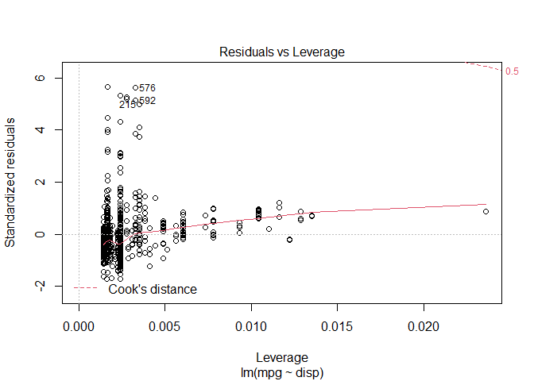
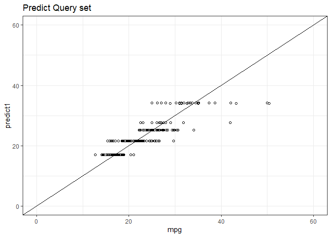

# R Programming: Linear Regression (OLS)

## Set Chunk requirements


```r
knitr::opts_chunk$set(echo = TRUE, message = FALSE, warning = FALSE)
#echo=FALSE indicates that the code will not be shown in the final document 
#(though any results/output would still be displayed).
#include=FALSE to have the chunk evaluated, but neither the code nor its output displayed
# warning=FALSE and message=FALSE suppress any R warnings or messages from being included 
#in the final document
```

## Load Relevant Packages and Data Set


```r
setwd('E:/Documents/Reinp/GitHub Respositories/Intro-to-ML-Regression-and-ML-Classification')

library(stats)
library(psych)
library(tidyverse)
## tidyverse includes readr, ggplot2, dplyr, forcats, tibble, tidyr, purrr, stringr

cars20_tr <- read_csv("data/cars20_train.csv")

view(cars20_tr)
```

## Exploratory Data Analysis

### Exploratory plots in base R 


```r
### Histogram of all MPGs

hist(cars20_tr$mpg, breaks = 30)
```

<!-- -->

```r
### Scatter plot of mpg vs disp 

plot(mpg~disp, data = cars20_tr)
```

<!-- -->

```r
### Box plots mpg vs transmission 
boxplot(mpg~transmission, data = cars20_tr)
```

<!-- -->

### Exploratory plots in ggplot2


```r
### What is the distribution of mpg?

mpg_hist <- ggplot(data = cars20_tr, 
       mapping = aes(
         x = mpg
       ) ) + geom_histogram(fill = "lightblue", colour = "black") +
  theme_bw()

mpg_hist
```

<!-- -->

```r
### What is the relationship between displacement and mpg?

displ_mpg_Scattplt <- ggplot(data = cars20_tr,
       mapping = aes(
         x = disp,
         y = mpg
       )) + geom_point(alpha = 0.3) + 
  geom_smooth()

displ_mpg_Scattplt
```

<!-- -->

```r
### What is the relationship between transmission type and mpg?

trans_mpg_boxplt <- ggplot(data = cars20_tr,
       aes(x = transmission, 
           y = mpg)) + 
  geom_boxplot() + theme_minimal()

trans_mpg_boxplt
```

<!-- -->

## Simple Linear Regression


```r
## Simple 1 variable model using displacement to predict mpg


model1 <- lm(mpg~disp, data = cars20_tr)

summary(model1)
```

```
## 
## Call:
## lm(formula = mpg ~ disp, data = cars20_tr)
## 
## Residuals:
##     Min      1Q  Median      3Q     Max 
## -7.9672 -2.6961 -0.9589  1.5168 26.2635 
## 
## Coefficients:
##             Estimate Std. Error t value Pr(>|t|)    
## (Intercept)  34.0545     0.4571   74.50   <2e-16 ***
## disp         -3.4271     0.1392  -24.62   <2e-16 ***
## ---
## Signif. codes:  0 '***' 0.001 '**' 0.01 '*' 0.05 '.' 0.1 ' ' 1
## 
## Residual standard error: 4.645 on 697 degrees of freedom
## Multiple R-squared:  0.4652,	Adjusted R-squared:  0.4644 
## F-statistic: 606.3 on 1 and 697 DF,  p-value: < 2.2e-16
```

```r
## To get the model predicted values, use the predict function. 
## It will output a vector of values: one for each car in the training data.

cars20_tr$predictmodel1 <- predict(model1, newdata = cars20_tr)

# predict(model1, newdata = cars20_tr, interval = "confidence")

cars20_tr$residualmodel1 <- cars20_tr$predictmodel1 - cars20_tr$mpg


cars20_tr <- cars20_tr %>% mutate(model1 = predict(model1, newdata = cars20_tr),
                                            residual1 = model1 - mpg)
```
### assess the model fit


```r
#plot(model1) ### shows several diagnostic graphs

plot(model1, 1)
```

<!-- -->

```r
plot(model1, 2)
```

<!-- -->

```r
plot(model1, 3)  
```

<!-- -->

```r
plot(model1, 4)  
```

<!-- -->

```r
plot(model1, 5)  
```

<!-- -->

```r
plot(model1, 6)
```

<!-- -->

```r
### Showing the fitted model vs the actual mpg values

ggplot(data = cars20_tr, 
       mapping = aes(
        x = mpg,
        y = predictmodel1
       )
) + 
  geom_point() + 
  geom_abline(slope = 1, intercept = 0, colour = "red") + 
  xlim(c(0,60)) + ylim(c(0,60))
```

<!-- -->

```r
### Showing the residual vs the actual mpg values

ggplot(
  data = cars20_tr,
  mapping = aes(
    x = mpg,
    y = residualmodel1
  )
) + 
  geom_point() + 
  geom_hline(yintercept = 0, linetype = "dashed", colour = "red")
```

<!-- -->

### Testing on the query set


```r
cars20_qu <- read_csv("data/cars20_query.csv")
view(cars20_qu)

cars20_qu$predictmodel1 <- predict(model1, newdata = cars20_qu)
cars20_qu$residualmodel1 <- cars20_qu$predictmodel1 - cars20_qu$mpg


ggplot(data = cars20_qu, 
       mapping = aes(
        x = mpg,
        y = predictmodel1
       )
) + 
  geom_point() + 
  geom_abline(slope = 1, intercept = 0, colour = "blue") + 
  xlim(c(0,60)) + ylim(c(0,60))
```

<!-- -->

```r
ggplot(
  data = cars20_qu,
  mapping = aes(
    x = mpg,
    y = residualmodel1
  )
) + 
  geom_point() + 
  geom_hline(yintercept = 0, linetype = "dashed",  colour = "blue")
```

<!-- -->

## Multiple linear regression


```r
model2 <- lm(mpg~disp+transmission+drive+atvType, data = cars20_tr) 
model2
```

```
## 
## Call:
## lm(formula = mpg ~ disp + transmission + drive + atvType, data = cars20_tr)
## 
## Coefficients:
##           (Intercept)                   disp        transmissionCVT  
##               29.9418                -2.3693                 5.0111  
##    transmissionManual               driveAWD               driveFWD  
##                0.7617                 0.6415                 5.1299  
##           drivePT 4WD               driveRWD             atvTypeFFV  
##               -0.5525                 1.2860                -2.0430  
##         atvTypeHybrid            atvTypeNone  atvTypePlug-in Hybrid  
##                4.2946                -2.2857                 1.8304
```

```r
summary(model2)
```

```
## 
## Call:
## lm(formula = mpg ~ disp + transmission + drive + atvType, data = cars20_tr)
## 
## Residuals:
##      Min       1Q   Median       3Q      Max 
## -10.1433  -1.7491   0.1127   1.5192  18.4502 
## 
## Coefficients:
##                       Estimate Std. Error t value Pr(>|t|)    
## (Intercept)            29.9418     1.0317  29.021  < 2e-16 ***
## disp                   -2.3693     0.1078 -21.973  < 2e-16 ***
## transmissionCVT         5.0111     0.4226  11.858  < 2e-16 ***
## transmissionManual      0.7617     0.3129   2.434  0.01517 *  
## driveAWD                0.6415     0.3838   1.671  0.09510 .  
## driveFWD                5.1299     0.4357  11.774  < 2e-16 ***
## drivePT 4WD            -0.5525     0.8349  -0.662  0.50834    
## driveRWD                1.2860     0.4021   3.198  0.00145 ** 
## atvTypeFFV             -2.0430     1.3585  -1.504  0.13307    
## atvTypeHybrid           4.2946     1.0882   3.946 8.75e-05 ***
## atvTypeNone            -2.2857     0.9834  -2.324  0.02040 *  
## atvTypePlug-in Hybrid   1.8304     1.2045   1.520  0.12906    
## ---
## Signif. codes:  0 '***' 0.001 '**' 0.01 '*' 0.05 '.' 0.1 ' ' 1
## 
## Residual standard error: 3.156 on 687 degrees of freedom
## Multiple R-squared:  0.7567,	Adjusted R-squared:  0.7528 
## F-statistic: 194.2 on 11 and 687 DF,  p-value: < 2.2e-16
```

```r
cars20_tr$model2 <- predict(model2, newdata = cars20_tr)

cars20_tr$residual2 <- cars20_tr$model2 - cars20_tr$mpg
```
### assess the model fit


```r
plot(model2)
```

<!-- --><!-- --><!-- --><!-- -->

```r
ggplot(data = cars20_tr, 
       mapping = aes(
        x = mpg,
        y = model2
       )
) + 
  geom_point() + 
  geom_abline(slope = 1, intercept = 0, colour = "green") + 
  xlim(c(0,60)) + ylim(c(0,60))
```

<!-- -->

```r
ggplot(
  data = cars20_tr,
  mapping = aes(
    x = mpg,
    y = residual2
  )
) + 
  geom_point() + geom_hline(yintercept = 0, linetype = "dashed", colour = "green")
```

<!-- -->

### Testing on the query set


```r
cars20_qu$predictmodel2 <- predict(model2, newdata = cars20_qu)
cars20_qu$residualmodel2 <- cars20_qu$predictmodel2 - cars20_qu$mpg


ggplot(data = cars20_qu, 
       mapping = aes(
        x = mpg,
        y = predictmodel2
       )
) + 
  geom_point() + 
  geom_abline(slope = 1, intercept = 0, colour = "yellow") + 
  xlim(c(0,60)) + ylim(c(0,60))
```

<!-- -->

```r
ggplot(
  data = cars20_qu,
  mapping = aes(
    x = mpg,
    y = residualmodel2
  )
) + 
  geom_point() + 
  geom_hline(yintercept = 0, linetype = "dashed",  colour = "yellow")
```

<!-- -->


# R Programming: Regression (Decision Trees)

## Making a model with two variables

### Training data


```r
library(rpart) ### for decision tree 
library(rpart.plot) ## for showing decision tree

cars20_trdt <- read_csv("data/cars20_train.csv")
view(cars20_trdt)

dt1 <- rpart(mpg~disp+transmission, data = cars20_trdt)
dt1
```

```
## n= 699 
## 
## node), split, n, deviance, yval
##       * denotes terminal node
## 
##  1) root 699 28117.730 23.66355  
##    2) disp>=2.6 376  3696.124 19.83845  
##      4) disp>=3.85 145   602.483 16.99314 *
##      5) disp< 3.85 231  1182.889 21.62447 *
##    3) disp< 2.6 323 12516.130 28.11629  
##      6) transmission=Automatic 181  1402.063 25.19021 *
##      7) transmission=CVT,Manual 142  7589.022 31.84601  
##       14) transmission=Manual 70  3379.064 29.52462  
##         28) disp>=1.7 49  1583.858 27.58026 *
##         29) disp< 1.7 21  1177.719 34.06145 *
##       15) transmission=CVT 72  3465.996 34.10292 *
```

```r
rpart.plot(dt1)
```

<!-- -->

```r
cars20_trdt$predict1 <- predict(dt1, newdata = cars20_trdt)
cars20_trdt$residual1 <- cars20_trdt$predict1 - cars20_trdt$mpg

## Comparing model values to actual values

ggplot(data = cars20_trdt,
       aes(x = mpg,
           y = predict1)) + 
  geom_point(shape = 21) + 
  xlim(c(0,60)) + 
  ylim(c(0,60)) + 
  geom_abline(slope = 1, intercept = 0, colour = "orange") + theme_bw() + 
  ggtitle("Predict Training set")
```

<!-- -->

```r
## Comparing residual values to actual values

ggplot(data = cars20_trdt,
  aes(x = mpg,
    y = residual1)) + 
  geom_point() + 
  geom_hline(yintercept = 0, linetype = "dashed", colour = "orange") +
  ggtitle("Residual Training set")
```

<!-- -->

### Query data


```r
cars20_qudt <- read_csv("data/cars20_query.csv")
view(cars20_qudt)

cars20_qudt$predict1 <- predict(dt1, newdata = cars20_qudt)
cars20_qudt$residual1 <- cars20_qudt$predict1 - cars20_qudt$mpg


ggplot(data = cars20_qudt,
       aes(x = mpg,
           y = predict1)) + 
  geom_point(shape = 21) + theme_bw() + 
  xlim(c(0,60)) + ylim(c(0,60)) + 
  geom_abline(slope = 1, intercept = 0) +
  ggtitle("Predict Query set")
```

<!-- -->

```r
ggplot(data = cars20_qudt,
  aes(x = mpg,
    y = residual1)) + 
  geom_point() + 
  geom_hline(yintercept = 0, linetype = "dashed") +
  ggtitle("Residual Query set")
```

<!-- -->

## Making a model with all available 

### Training data


```r
## create a data set without the make and model variables using dplyr::select

cars20_trdt2 <- read_csv("data/cars20_train.csv") %>%
  select(-make, -model)
view(cars20_trdt2)


dt2 <- rpart(mpg~., data = cars20_trdt2)
rpart.plot(dt2)
```

<!-- -->

```r
cars20_trdt2$predict1 <- predict(dt2, newdata = cars20_trdt2)
cars20_trdt2$residual1 <- cars20_trdt2$predict1 - cars20_trdt2$mpg

ggplot(data = cars20_trdt2,
       aes(x = mpg,
           y = predict1)) + 
  geom_point() + 
  xlim(c(0,60)) + 
  ylim(c(0,60)) + 
  geom_abline(slope = 1, intercept = 0, colour = "purple") + theme_bw() + 
  ggtitle("Predict Training set")
```

<!-- -->

```r
ggplot(data = cars20_trdt2,
  aes(x = mpg,
    y = residual1)) + 
  geom_point() + 
  geom_hline(yintercept = 0, linetype = "dashed", colour = "purple") +
  ggtitle("Residual Training set")
```

<!-- -->

### Query data


```r
cars20_qudt2 <- read_csv("data/cars20_query.csv")

cars20_qudt2 <- subset(cars20_qudt2, select = -c(make,model)) #Delete columns by name

cars20_qudt2 <- cars20_qudt2[ !(cars20_qudt2$class == "Passenger Van"), ]
view(cars20_qudt2)

### Query data has a factor (class) with new level (Passenger Van) not in train data
#1. delete the Passenger Van rows from query data set and model will run perfectly

#2. You could try updating dt2$xlevels[["class"]] in the model object
# dt2$xlevels[["class"]] <- union(dt2$xlevels[["class"]], levels(cars20_qudt2$class))

#3. exclude (but not remove) "class" from the training data
#dt2 <- rpart(mpg~., data=cars20_trdt2[,!colnames(cars20_trdt2) %in% c("class")])


cars20_qudt2$predict1 <- predict(dt2, newdata = cars20_qudt2)
cars20_qudt2$residual1 <- cars20_qudt2$predict1 - cars20_qudt2$mpg


ggplot(data = cars20_qudt2,
       aes(x = mpg,
           y = predict1)) + 
  geom_point() + 
  xlim(c(0,60)) + 
  ylim(c(0,60)) + 
  geom_abline(slope = 1, intercept = 0, colour = "brown") + theme_bw() + 
  ggtitle("Predict Training set")
```

<!-- -->

```r
ggplot(data = cars20_qudt2,
  aes(x = mpg,
    y = residual1)) + 
  geom_point() + 
  geom_hline(yintercept = 0, linetype = "dashed", colour = "brown") +
  ggtitle("Residual Training set")
```

<!-- -->

# R Programming: Classification

## Load Data Set


```r
stackoverflow <- read_csv("data2/stackoverflow.csv")

view(stackoverflow)

# Print stackoverflow
glimpse(stackoverflow)
```

```
## Rows: 6,991
## Columns: 22
## $ Respondent                             <dbl> 3, 15, 18, 19, 26, 55, 62, 7...
## $ Country                                <chr> "United Kingdom", "United Ki...
## $ Salary                                 <dbl> 113750.000, 100000.000, 1300...
## $ YearsCodedJob                          <dbl> 20, 20, 20, 3, 16, 4, 1, 1, ...
## $ OpenSource                             <lgl> TRUE, FALSE, TRUE, FALSE, FA...
## $ Hobby                                  <lgl> TRUE, TRUE, TRUE, TRUE, TRUE...
## $ CompanySizeNumber                      <dbl> 10000, 5000, 1000, 10000, 10...
## $ Remote                                 <chr> "Not remote", "Remote", "Rem...
## $ CareerSatisfaction                     <dbl> 8, 8, 9, 5, 7, 9, 5, 8, 8, 1...
## $ `Data scientist`                       <lgl> FALSE, FALSE, FALSE, FALSE, ...
## $ `Database administrator`               <lgl> FALSE, FALSE, FALSE, FALSE, ...
## $ `Desktop applications developer`       <lgl> FALSE, FALSE, FALSE, FALSE, ...
## $ `Developer with stats/math background` <lgl> FALSE, FALSE, FALSE, FALSE, ...
## $ DevOps                                 <lgl> FALSE, FALSE, TRUE, FALSE, F...
## $ `Embedded developer`                   <lgl> FALSE, TRUE, TRUE, FALSE, FA...
## $ `Graphic designer`                     <lgl> FALSE, FALSE, FALSE, FALSE, ...
## $ `Graphics programming`                 <lgl> FALSE, FALSE, FALSE, FALSE, ...
## $ `Machine learning specialist`          <lgl> FALSE, FALSE, FALSE, FALSE, ...
## $ `Mobile developer`                     <lgl> FALSE, FALSE, FALSE, FALSE, ...
## $ `Quality assurance engineer`           <lgl> FALSE, FALSE, TRUE, FALSE, F...
## $ `Systems administrator`                <lgl> FALSE, FALSE, FALSE, FALSE, ...
## $ `Web developer`                        <lgl> FALSE, FALSE, TRUE, TRUE, TR...
```

```r
str(stackoverflow)
```

```
## tibble [6,991 x 22] (S3: spec_tbl_df/tbl_df/tbl/data.frame)
##  $ Respondent                          : num [1:6991] 3 15 18 19 26 55 62 71 73 77 ...
##  $ Country                             : chr [1:6991] "United Kingdom" "United Kingdom" "United States" "United States" ...
##  $ Salary                              : num [1:6991] 113750 100000 130000 82500 175000 ...
##  $ YearsCodedJob                       : num [1:6991] 20 20 20 3 16 4 1 1 20 20 ...
##  $ OpenSource                          : logi [1:6991] TRUE FALSE TRUE FALSE FALSE FALSE ...
##  $ Hobby                               : logi [1:6991] TRUE TRUE TRUE TRUE TRUE FALSE ...
##  $ CompanySizeNumber                   : num [1:6991] 10000 5000 1000 10000 10000 1000 5000 20 100 1000 ...
##  $ Remote                              : chr [1:6991] "Not remote" "Remote" "Remote" "Not remote" ...
##  $ CareerSatisfaction                  : num [1:6991] 8 8 9 5 7 9 5 8 8 10 ...
##  $ Data scientist                      : logi [1:6991] FALSE FALSE FALSE FALSE FALSE FALSE ...
##  $ Database administrator              : logi [1:6991] FALSE FALSE FALSE FALSE FALSE FALSE ...
##  $ Desktop applications developer      : logi [1:6991] FALSE FALSE FALSE FALSE FALSE FALSE ...
##  $ Developer with stats/math background: logi [1:6991] FALSE FALSE FALSE FALSE FALSE FALSE ...
##  $ DevOps                              : logi [1:6991] FALSE FALSE TRUE FALSE FALSE FALSE ...
##  $ Embedded developer                  : logi [1:6991] FALSE TRUE TRUE FALSE FALSE FALSE ...
##  $ Graphic designer                    : logi [1:6991] FALSE FALSE FALSE FALSE FALSE FALSE ...
##  $ Graphics programming                : logi [1:6991] FALSE FALSE FALSE FALSE FALSE FALSE ...
##  $ Machine learning specialist         : logi [1:6991] FALSE FALSE FALSE FALSE FALSE FALSE ...
##  $ Mobile developer                    : logi [1:6991] FALSE FALSE FALSE FALSE FALSE FALSE ...
##  $ Quality assurance engineer          : logi [1:6991] FALSE FALSE TRUE FALSE FALSE FALSE ...
##  $ Systems administrator               : logi [1:6991] FALSE FALSE FALSE FALSE FALSE FALSE ...
##  $ Web developer                       : logi [1:6991] FALSE FALSE TRUE TRUE TRUE TRUE ...
##  - attr(*, "spec")=
##   .. cols(
##   ..   Respondent = col_double(),
##   ..   Country = col_character(),
##   ..   Salary = col_double(),
##   ..   YearsCodedJob = col_double(),
##   ..   OpenSource = col_logical(),
##   ..   Hobby = col_logical(),
##   ..   CompanySizeNumber = col_double(),
##   ..   Remote = col_character(),
##   ..   CareerSatisfaction = col_double(),
##   ..   `Data scientist` = col_logical(),
##   ..   `Database administrator` = col_logical(),
##   ..   `Desktop applications developer` = col_logical(),
##   ..   `Developer with stats/math background` = col_logical(),
##   ..   DevOps = col_logical(),
##   ..   `Embedded developer` = col_logical(),
##   ..   `Graphic designer` = col_logical(),
##   ..   `Graphics programming` = col_logical(),
##   ..   `Machine learning specialist` = col_logical(),
##   ..   `Mobile developer` = col_logical(),
##   ..   `Quality assurance engineer` = col_logical(),
##   ..   `Systems administrator` = col_logical(),
##   ..   `Web developer` = col_logical()
##   .. )
```

## Exploring the Stack Overflow Survey


```r
count(stackoverflow, Remote, sort = TRUE)
```

```
## # A tibble: 2 x 2
##   Remote         n
##   <chr>      <int>
## 1 Not remote  6273
## 2 Remote       718
```

```r
count(stackoverflow, Country, sort = TRUE)
```

```
## # A tibble: 5 x 2
##   Country            n
##   <chr>          <int>
## 1 United States   3486
## 2 United Kingdom  1270
## 3 Germany          950
## 4 India            666
## 5 Canada           619
```

```r
#Dolar sign Syntax
table(stackoverflow$Remote)
```

```
## 
## Not remote     Remote 
##       6273        718
```

```r
table(stackoverflow$Country)
```

```
## 
##         Canada        Germany          India United Kingdom  United States 
##            619            950            666           1270           3486
```

```r
ggplot(stackoverflow, 
       aes(x = Remote, y = YearsCodedJob)) +
    geom_boxplot() +
    labs(x = NULL,
         y = "Years of professional coding experience")
```

<!-- -->

```r
ggplot(stackoverflow, 
       aes(x = Remote, y = Salary)) +
    geom_boxplot() +
    labs(x = NULL,
         y = "Salary")
```

<!-- -->

```r
ggplot(stackoverflow, 
       aes(x = Remote, y = CareerSatisfaction)) +
    geom_boxplot() +
    labs(x = NULL,
         y = "Career Sattisfaction")
```

<!-- -->

## Create training and test sets


```r
## Remove the Respondent column

stackoverflow1 <- select(stackoverflow, -Respondent)

## convert the Remote variable to a 0-1 variable

stackoverflow2 <- mutate(stackoverflow1, Remote = ifelse(Remote == "Remote", 1,0))

## Create training and test sets (in a 80:20 ratio)

# Split the data into training and testing sets
set.seed(1234)
library(rsample)
stack_split <- initial_split(stackoverflow2, prop = 0.8)

stack_train <- training(stack_split)
stack_test <- testing(stack_split)
```

## Fit a simple model

### Build a simple logistic regression model


```r
simple_glm <- glm(Remote~., family = "binomial", data = stack_train)
simple_glm
```

```
## 
## Call:  glm(formula = Remote ~ ., family = "binomial", data = stack_train)
## 
## Coefficients:
##                                (Intercept)  
##                                 -3.929e+00  
##                             CountryGermany  
##                                 -3.083e-01  
##                               CountryIndia  
##                                  7.780e-01  
##                      CountryUnited Kingdom  
##                                 -4.925e-02  
##                       CountryUnited States  
##                                  4.564e-01  
##                                     Salary  
##                                  4.632e-06  
##                              YearsCodedJob  
##                                  6.587e-02  
##                             OpenSourceTRUE  
##                                  4.647e-01  
##                                  HobbyTRUE  
##                                  3.251e-02  
##                          CompanySizeNumber  
##                                 -6.976e-05  
##                         CareerSatisfaction  
##                                  5.524e-02  
##                       `Data scientist`TRUE  
##                                 -1.600e-01  
##               `Database administrator`TRUE  
##                                  3.070e-01  
##       `Desktop applications developer`TRUE  
##                                 -3.062e-01  
## `Developer with stats/math background`TRUE  
##                                  9.944e-02  
##                                 DevOpsTRUE  
##                                 -1.731e-01  
##                   `Embedded developer`TRUE  
##                                 -2.264e-01  
##                     `Graphic designer`TRUE  
##                                 -1.936e-01  
##                 `Graphics programming`TRUE  
##                                  1.316e-01  
##          `Machine learning specialist`TRUE  
##                                 -2.142e-01  
##                     `Mobile developer`TRUE  
##                                  1.904e-01  
##           `Quality assurance engineer`TRUE  
##                                 -1.741e-01  
##                `Systems administrator`TRUE  
##                                  8.991e-02  
##                        `Web developer`TRUE  
##                                  9.265e-02  
## 
## Degrees of Freedom: 5592 Total (i.e. Null);  5569 Residual
## Null Deviance:	    3696 
## Residual Deviance: 3421 	AIC: 3469
```

```r
summary(simple_glm)
```

```
## 
## Call:
## glm(formula = Remote ~ ., family = "binomial", data = stack_train)
## 
## Deviance Residuals: 
##     Min       1Q   Median       3Q      Max  
## -1.1993  -0.4991  -0.3845  -0.2902   2.9282  
## 
## Coefficients:
##                                              Estimate Std. Error z value
## (Intercept)                                -3.929e+00  3.246e-01 -12.103
## CountryGermany                             -3.083e-01  2.402e-01  -1.283
## CountryIndia                                7.780e-01  2.466e-01   3.155
## CountryUnited Kingdom                      -4.925e-02  2.157e-01  -0.228
## CountryUnited States                        4.564e-01  1.960e-01   2.329
## Salary                                      4.632e-06  1.775e-06   2.610
## YearsCodedJob                               6.587e-02  8.476e-03   7.771
## OpenSourceTRUE                              4.647e-01  9.532e-02   4.875
## HobbyTRUE                                   3.251e-02  1.110e-01   0.293
## CompanySizeNumber                          -6.976e-05  1.391e-05  -5.016
## CareerSatisfaction                          5.524e-02  2.976e-02   1.856
## `Data scientist`TRUE                       -1.600e-01  2.085e-01  -0.768
## `Database administrator`TRUE                3.070e-01  1.426e-01   2.152
## `Desktop applications developer`TRUE       -3.062e-01  1.108e-01  -2.763
## `Developer with stats/math background`TRUE  9.944e-02  1.497e-01   0.664
## DevOpsTRUE                                 -1.731e-01  1.451e-01  -1.193
## `Embedded developer`TRUE                   -2.264e-01  1.811e-01  -1.250
## `Graphic designer`TRUE                     -1.936e-01  3.088e-01  -0.627
## `Graphics programming`TRUE                  1.316e-01  2.589e-01   0.508
## `Machine learning specialist`TRUE          -2.142e-01  3.128e-01  -0.685
## `Mobile developer`TRUE                      1.904e-01  1.144e-01   1.664
## `Quality assurance engineer`TRUE           -1.741e-01  2.588e-01  -0.673
## `Systems administrator`TRUE                 8.991e-02  1.600e-01   0.562
## `Web developer`TRUE                         9.265e-02  1.108e-01   0.836
##                                            Pr(>|z|)    
## (Intercept)                                 < 2e-16 ***
## CountryGermany                              0.19936    
## CountryIndia                                0.00161 ** 
## CountryUnited Kingdom                       0.81941    
## CountryUnited States                        0.01988 *  
## Salary                                      0.00906 ** 
## YearsCodedJob                              7.77e-15 ***
## OpenSourceTRUE                             1.09e-06 ***
## HobbyTRUE                                   0.76962    
## CompanySizeNumber                          5.27e-07 ***
## CareerSatisfaction                          0.06347 .  
## `Data scientist`TRUE                        0.44276    
## `Database administrator`TRUE                0.03137 *  
## `Desktop applications developer`TRUE        0.00573 ** 
## `Developer with stats/math background`TRUE  0.50661    
## DevOpsTRUE                                  0.23299    
## `Embedded developer`TRUE                    0.21136    
## `Graphic designer`TRUE                      0.53066    
## `Graphics programming`TRUE                  0.61121    
## `Machine learning specialist`TRUE           0.49356    
## `Mobile developer`TRUE                      0.09605 .  
## `Quality assurance engineer`TRUE            0.50107    
## `Systems administrator`TRUE                 0.57411    
## `Web developer`TRUE                         0.40300    
## ---
## Signif. codes:  0 '***' 0.001 '**' 0.01 '*' 0.05 '.' 0.1 ' ' 1
## 
## (Dispersion parameter for binomial family taken to be 1)
## 
##     Null deviance: 3696.2  on 5592  degrees of freedom
## Residual deviance: 3421.3  on 5569  degrees of freedom
## AIC: 3469.3
## 
## Number of Fisher Scoring iterations: 5
```

```r
#CountryIndia, CountryUnitedStates, Salary , YearsCodedJob, OpenSourceTRUE, 
#CompanySizeNumber, CareerSatisfaction, Database administrator`TRUE, 
#Desktop applications developer`TRUE are significant.


#The logistic regression coefficients give the change in the log odds of the outcome 
#for a one unit increase in the predictor variable.

#For a one unit increase in salary, the change in log odds of developers more likely 
#to work remotely increases by 0.000004632 holding all other variables constant.

#For a one unit increase in CompanySizeNumber, the change in log odds of developers more 
#likely to work remotely decreases by 0.00006976 holding all other variables constant.

#The log odds of being a Database administrator likely to work remotely is 0.3070 
#higher than the log odds of not being a Database administrator holding all other 
#variables constant.

#The log odds of being a Desktop applications developer likely to work remotely is 0.3062 
#lower than the log odds of not being a Desktop applications developer holding all other 
#variables constant.
```

### confidence intervals for the coefficient & odds Ratio


```r
### CIs using profiled log-likelihood
confint(simple_glm)
```

```
##                                                    2.5 %        97.5 %
## (Intercept)                                -4.575923e+00 -3.302771e+00
## CountryGermany                             -7.796273e-01  1.653566e-01
## CountryIndia                                2.972807e-01  1.266285e+00
## CountryUnited Kingdom                      -4.660744e-01  3.819831e-01
## CountryUnited States                        8.312417e-02  8.533639e-01
## Salary                                      1.149637e-06  8.108973e-06
## YearsCodedJob                               4.922249e-02  8.245997e-02
## OpenSourceTRUE                              2.775303e-01  6.513491e-01
## HobbyTRUE                                  -1.824762e-01  2.529741e-01
## CompanySizeNumber                          -9.765964e-05 -4.308152e-05
## CareerSatisfaction                         -2.446600e-03  1.142539e-01
## `Data scientist`TRUE                       -5.825098e-01  2.364313e-01
## `Database administrator`TRUE                2.355883e-02  5.830825e-01
## `Desktop applications developer`TRUE       -5.260276e-01 -9.136342e-02
## `Developer with stats/math background`TRUE -2.007415e-01  3.869194e-01
## DevOpsTRUE                                 -4.632466e-01  1.061513e-01
## `Embedded developer`TRUE                   -5.938462e-01  1.177333e-01
## `Graphic designer`TRUE                     -8.437266e-01  3.758465e-01
## `Graphics programming`TRUE                 -4.021278e-01  6.175541e-01
## `Machine learning specialist`TRUE          -8.607913e-01  3.720398e-01
## `Mobile developer`TRUE                     -3.684878e-02  4.119950e-01
## `Quality assurance engineer`TRUE           -7.109050e-01  3.085571e-01
## `Systems administrator`TRUE                -2.283936e-01  3.992215e-01
## `Web developer`TRUE                        -1.223527e-01  3.122323e-01
```

```r
### CIs using standard errors
confint.default(simple_glm)
```

```
##                                                    2.5 %        97.5 %
## (Intercept)                                -4.565354e+00 -3.292829e+00
## CountryGermany                             -7.791681e-01  1.625366e-01
## CountryIndia                                2.945995e-01  1.261325e+00
## CountryUnited Kingdom                      -4.720777e-01  3.735739e-01
## CountryUnited States                        7.224339e-02  8.405772e-01
## Salary                                      1.153248e-06  8.110591e-06
## YearsCodedJob                               4.925741e-02  8.248277e-02
## OpenSourceTRUE                              2.778656e-01  6.515278e-01
## HobbyTRUE                                  -1.850573e-01  2.500799e-01
## CompanySizeNumber                          -9.702372e-05 -4.250590e-05
## CareerSatisfaction                         -3.098108e-03  1.135779e-01
## `Data scientist`TRUE                       -5.687185e-01  2.486344e-01
## `Database administrator`TRUE                2.743982e-02  5.865565e-01
## `Desktop applications developer`TRUE       -5.233664e-01 -8.897131e-02
## `Developer with stats/math background`TRUE -1.940256e-01  3.929079e-01
## DevOpsTRUE                                 -4.575040e-01  1.113425e-01
## `Embedded developer`TRUE                   -5.813440e-01  1.286127e-01
## `Graphic designer`TRUE                     -7.988258e-01  4.116022e-01
## `Graphics programming`TRUE                 -3.758333e-01  6.390614e-01
## `Machine learning specialist`TRUE          -8.272337e-01  3.989120e-01
## `Mobile developer`TRUE                     -3.382809e-02  4.146837e-01
## `Quality assurance engineer`TRUE           -6.812962e-01  3.330866e-01
## `Systems administrator`TRUE                -2.236373e-01  4.034506e-01
## `Web developer`TRUE                        -1.244970e-01  3.098069e-01
```

```r
###exponentiate the coefficients and interpret them as odds-ratios
## odds ratios only
exp(coef(simple_glm))
```

```
##                                (Intercept) 
##                                 0.01966153 
##                             CountryGermany 
##                                 0.73468330 
##                               CountryIndia 
##                                 2.17703187 
##                      CountryUnited Kingdom 
##                                 0.95194130 
##                       CountryUnited States 
##                                 1.57839783 
##                                     Salary 
##                                 1.00000463 
##                              YearsCodedJob 
##                                 1.06808796 
##                             OpenSourceTRUE 
##                                 1.59153142 
##                                  HobbyTRUE 
##                                 1.03304555 
##                          CompanySizeNumber 
##                                 0.99993024 
##                         CareerSatisfaction 
##                                 1.05679409 
##                       `Data scientist`TRUE 
##                                 0.85210799 
##               `Database administrator`TRUE 
##                                 1.35933849 
##       `Desktop applications developer`TRUE 
##                                 0.73626227 
## `Developer with stats/math background`TRUE 
##                                 1.10455343 
##                                 DevOpsTRUE 
##                                 0.84106969 
##                   `Embedded developer`TRUE 
##                                 0.79742646 
##                     `Graphic designer`TRUE 
##                                 0.82397768 
##                 `Graphics programming`TRUE 
##                                 1.14066801 
##          `Machine learning specialist`TRUE 
##                                 0.80721853 
##                     `Mobile developer`TRUE 
##                                 1.20976701 
##           `Quality assurance engineer`TRUE 
##                                 0.84020887 
##                `Systems administrator`TRUE 
##                                 1.09407213 
##                        `Web developer`TRUE 
##                                 1.09708314
```

```r
#column-wise.
## odds ratios and 95% CI
exp(cbind(OR = coef(simple_glm), confint(simple_glm)))
```

```
##                                                    OR     2.5 %     97.5 %
## (Intercept)                                0.01966153 0.0102968 0.03678111
## CountryGermany                             0.73468330 0.4585769 1.17981380
## CountryIndia                               2.17703187 1.3461931 3.54764732
## CountryUnited Kingdom                      0.95194130 0.6274606 1.46518729
## CountryUnited States                       1.57839783 1.0866767 2.34753037
## Salary                                     1.00000463 1.0000011 1.00000811
## YearsCodedJob                              1.06808796 1.0504540 1.08595520
## OpenSourceTRUE                             1.59153142 1.3198662 1.91812680
## HobbyTRUE                                  1.03304555 0.8332045 1.28784996
## CompanySizeNumber                          0.99993024 0.9999023 0.99995692
## CareerSatisfaction                         1.05679409 0.9975564 1.12103676
## `Data scientist`TRUE                       0.85210799 0.5584949 1.26672053
## `Database administrator`TRUE               1.35933849 1.0238385 1.79155234
## `Desktop applications developer`TRUE       0.73626227 0.5909478 0.91268597
## `Developer with stats/math background`TRUE 1.10455343 0.8181239 1.47243779
## DevOpsTRUE                                 0.84106969 0.6292375 1.11199005
## `Embedded developer`TRUE                   0.79742646 0.5521993 1.12494401
## `Graphic designer`TRUE                     0.82397768 0.4301047 1.45622353
## `Graphics programming`TRUE                 1.14066801 0.6688953 1.85438685
## `Machine learning specialist`TRUE          0.80721853 0.4228274 1.45069065
## `Mobile developer`TRUE                     1.20976701 0.9638219 1.50982681
## `Quality assurance engineer`TRUE           0.84020887 0.4911995 1.36145925
## `Systems administrator`TRUE                1.09407213 0.7958110 1.49066379
## `Web developer`TRUE                        1.09708314 0.8848362 1.36647211
```

```r
#For every one unit increase in Salary, the odds of developers more likely 
#to work remotely increases by a factor of 1.00000463 holding all other variables 
#constant.


#For every one unit increase in CompanySizeNumber, the odds of developers more likely 
#to work remotely decreases by a factor of 0.99993024 holding all other variables 
#constant.


#The odds of being a Database administrator likely to work remotely is 1.35933849 times 
#the odds of not being a Database administrator holding all other variables constant.


#The odds of being a Desktop applications developer likely to work remotely is 0.73626227 
#times the odds of not being a Desktop applications developer holding all other variables
#constant.
```

### Assessing the model


```r
#We may also wish to see measures of how well our model fits. This can be particularly
#useful when comparing competing models.

#The output produced by summary(simple_glm) included indices of fit, including 
#the null and deviance residuals and the AIC.

#One measure of model fit is the significance of the overall model. This test asks
#whether the model with predictors fits significantly better than a model with just an
#intercept (i.e., a null model).

#The test statistic is the difference between the residual deviance for the model
#with predictors and the null model. The test statistic is distributed chi-squared
#with degrees of freedom equal to the differences in degrees of freedom between the
#current and the null model (i.e., the number of predictor variables in the model).


#To find the difference in deviance for the two models (i.e., the test statistic),
#we use the command:
with(simple_glm, null.deviance - deviance)
```

```
## [1] 274.8713
```

```r
#The degrees of freedom for the difference between the two models is equal to the number of
#predictor variables in the model, and can be obtained using:
with(simple_glm, df.null - df.residual)
```

```
## [1] 23
```

```r
#the p-value can be obtained using:
with(simple_glm, pchisq(null.deviance - deviance, df.null - df.residual, lower.tail = FALSE))
```

```
## [1] 5.26266e-45
```

```r
#To see the model’s log likelihood, we type:
logLik(simple_glm)
```

```
## 'log Lik.' -1710.67 (df=24)
```

```r
#(The Residual deviance is -2*log likelihood)
#-2*-1710.67=3421.34


#The chi-square of 274.8713 with 23 degrees of freedom and an associated p-value of less
#than 0.001 (5.26266e-45) tells us that our model as a whole fits significantly better
#than an empty model. This is sometimes called a likelihood ratio test.
```

### Removing unsignificant variables from the model


```r
simple_glm1 <- glm(Remote~. - Hobby - `Data scientist`-
                     `Developer with stats/math background` - DevOps -
                     `Embedded developer` - `Graphic designer` -
                     `Graphics programming` - `Machine learning specialist` -
                     `Mobile developer` - `Quality assurance engineer` -
                     `Systems administrator` - `Web developer` , family = "binomial",
                   data = stack_train)
simple_glm1
```

```
## 
## Call:  glm(formula = Remote ~ . - Hobby - `Data scientist` - `Developer with stats/math background` - 
##     DevOps - `Embedded developer` - `Graphic designer` - `Graphics programming` - 
##     `Machine learning specialist` - `Mobile developer` - `Quality assurance engineer` - 
##     `Systems administrator` - `Web developer`, family = "binomial", 
##     data = stack_train)
## 
## Coefficients:
##                          (Intercept)                        CountryGermany  
##                           -3.825e+00                            -3.190e-01  
##                         CountryIndia                 CountryUnited Kingdom  
##                            7.933e-01                            -4.313e-02  
##                 CountryUnited States                                Salary  
##                            4.622e-01                             4.302e-06  
##                        YearsCodedJob                        OpenSourceTRUE  
##                            6.502e-02                             4.601e-01  
##                    CompanySizeNumber                    CareerSatisfaction  
##                           -7.243e-05                             5.808e-02  
##         `Database administrator`TRUE  `Desktop applications developer`TRUE  
##                            3.074e-01                            -3.023e-01  
## 
## Degrees of Freedom: 5592 Total (i.e. Null);  5581 Residual
## Null Deviance:	    3696 
## Residual Deviance: 3431 	AIC: 3455
```

```r
summary(simple_glm1)
```

```
## 
## Call:
## glm(formula = Remote ~ . - Hobby - `Data scientist` - `Developer with stats/math background` - 
##     DevOps - `Embedded developer` - `Graphic designer` - `Graphics programming` - 
##     `Machine learning specialist` - `Mobile developer` - `Quality assurance engineer` - 
##     `Systems administrator` - `Web developer`, family = "binomial", 
##     data = stack_train)
## 
## Deviance Residuals: 
##     Min       1Q   Median       3Q      Max  
## -1.2032  -0.4977  -0.3876  -0.2946   2.8544  
## 
## Coefficients:
##                                        Estimate Std. Error z value Pr(>|z|)    
## (Intercept)                          -3.825e+00  3.026e-01 -12.640  < 2e-16 ***
## CountryGermany                       -3.190e-01  2.397e-01  -1.331  0.18327    
## CountryIndia                          7.933e-01  2.447e-01   3.242  0.00119 ** 
## CountryUnited Kingdom                -4.313e-02  2.150e-01  -0.201  0.84101    
## CountryUnited States                  4.622e-01  1.954e-01   2.365  0.01802 *  
## Salary                                4.302e-06  1.747e-06   2.462  0.01381 *  
## YearsCodedJob                         6.502e-02  8.358e-03   7.780 7.25e-15 ***
## OpenSourceTRUE                        4.601e-01  9.275e-02   4.961 7.02e-07 ***
## CompanySizeNumber                    -7.243e-05  1.384e-05  -5.234 1.66e-07 ***
## CareerSatisfaction                    5.808e-02  2.957e-02   1.964  0.04954 *  
## `Database administrator`TRUE          3.074e-01  1.239e-01   2.482  0.01306 *  
## `Desktop applications developer`TRUE -3.023e-01  1.079e-01  -2.803  0.00506 ** 
## ---
## Signif. codes:  0 '***' 0.001 '**' 0.01 '*' 0.05 '.' 0.1 ' ' 1
## 
## (Dispersion parameter for binomial family taken to be 1)
## 
##     Null deviance: 3696.2  on 5592  degrees of freedom
## Residual deviance: 3431.5  on 5581  degrees of freedom
## AIC: 3455.5
## 
## Number of Fisher Scoring iterations: 5
```

### Predicting the model


```r
#Add the prediction as a column to the training set
stack_train$Predictsimple_glm <- predict(simple_glm, newdata = stack_train,
                                     type = "response")

stack_train$Predictsimple_glm1 <- predict(simple_glm1, newdata = stack_train,
                                     type = "response")
```

### Visualising model predicted values


```r
ggplot(stack_train, aes(x = Predictsimple_glm)) + 
  geom_histogram(fill = "skyblue", colour = "black") + facet_wrap(~Remote, ncol = 1, 
                                scales = "free_y")
```

<!-- -->

```r
ggplot(stack_train, aes(x = Predictsimple_glm1)) + 
  geom_histogram(fill = "magenta", colour = "grey") + facet_wrap(~Remote, ncol = 1, 
                                scales = "free_y")
```

<!-- -->

```r
ggplot(stack_train, aes(x = Predictsimple_glm)) + 
  geom_density(colour = "red") + facet_wrap(~Remote, ncol = 1, 
                                scales = "free_y")
```

<!-- -->

```r
ggplot(stack_train, aes(x = Predictsimple_glm1)) + 
  geom_density(colour = "green") + facet_wrap(~Remote, ncol = 1, 
                                scales = "free_y")
```

<!-- -->

## A decision tree version


```r
stack_train2 <- training(stack_split)

library(rpart)
simple_tree <- rpart(Remote~., data = stack_train2)

simple_tree
```

```
## n= 5593 
## 
## node), split, n, deviance, yval
##       * denotes terminal node
## 
## 1) root 5593 514.29640 0.10244950  
##   2) Salary< 88944 3824 250.93620 0.07060669  
##     4) CompanySizeNumber>=5.5 3496 194.74340 0.05921053 *
##     5) CompanySizeNumber< 5.5 328  50.89939 0.19207320 *
##   3) Salary>=88944 1769 251.10120 0.17128320  
##     6) CompanySizeNumber>=300 940  97.12766 0.11702130 *
##     7) CompanySizeNumber< 300 829 148.06760 0.23281060 *
```

```r
library(rpart.plot)

rpart.plot(simple_tree)
```

<!-- -->


